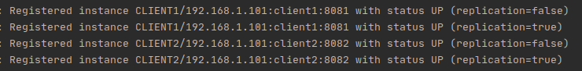
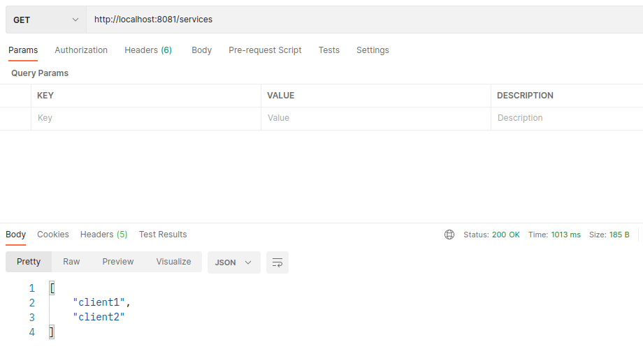
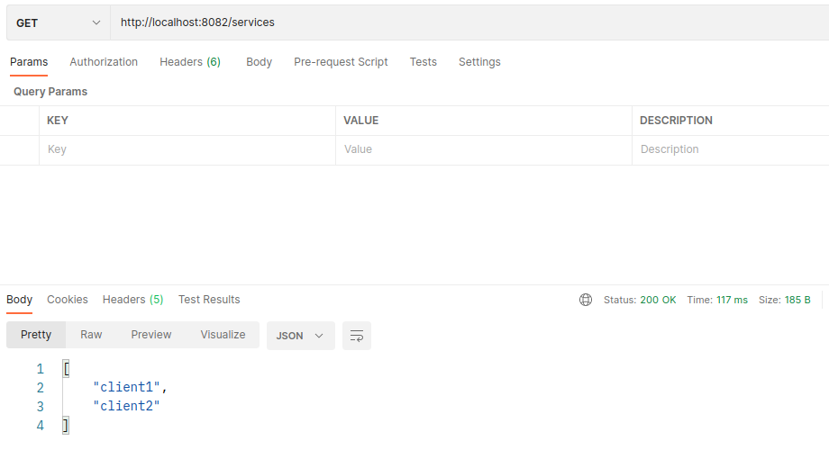
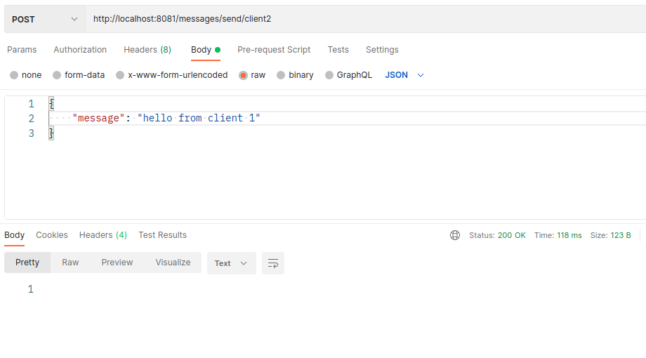
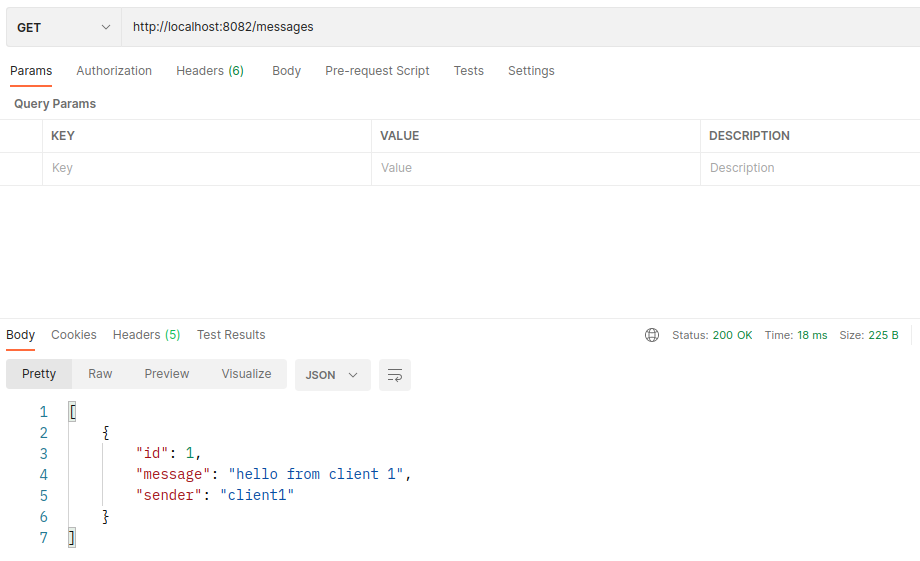

# Service Discovery

## О проекте
Учебный проект демонстрирующий работу Service Discovery

## Сборка
JDK14, Maven, SpringBoot, SpringCloudEurekaServer, SpringCloudEurekaClient

## Как пользоваться
1. Запускаем EurekaServer: "mvn spring-boot:run"

2. Запускаем двух клиентов EurekaClient:

    "java -jar target/discoveryclient-0.0.1-SNAPSHOT.jar --spring.config.location=file:///home/kustoff/projects/discoveryserver/discoveryclient/cfg/client1.properties"
    
    "java -jar target/discoveryclient-0.0.1-SNAPSHOT.jar --spring.config.location=file:///home/kustoff/projects/discoveryserver/discoveryclient/cfg/client2.properties"

3. Проверяем логи EurekaServer, если все прошло успешно в них должны появиться следующие строки:
    
    
  
4. Со стороны клиентов проверяем доступ к списку всех клиентов, зарегистрированных в ServiceRegistry:
     
     
     
       
       
5. Отправляем сообщение от клиента №1 клиенту №2, затем проверяем факт доставки:
    
     
         
       
    
## Контакты
Кутявин Владимир

skype: tribuna87

email: tribuna87@mail.ru

telegram: @kutiavinvladimir